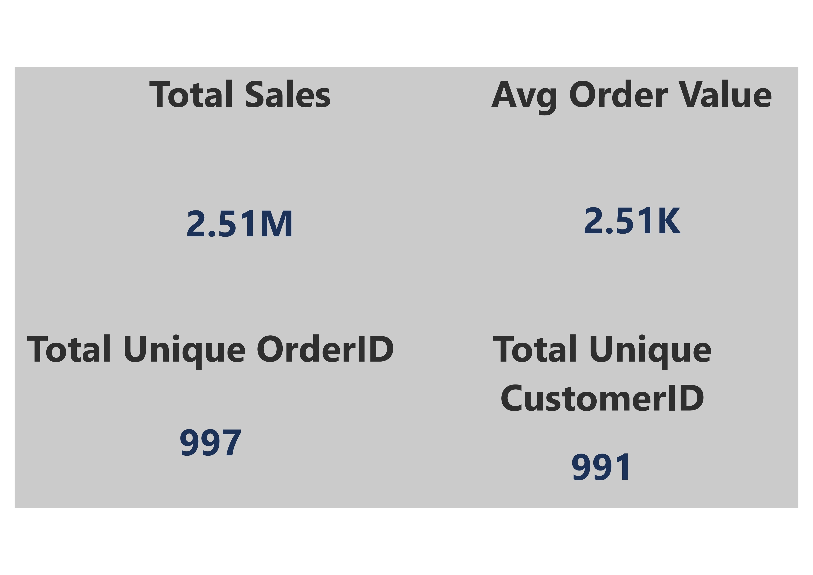
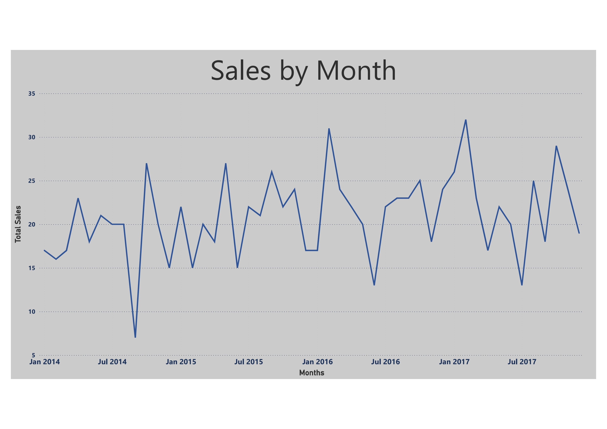
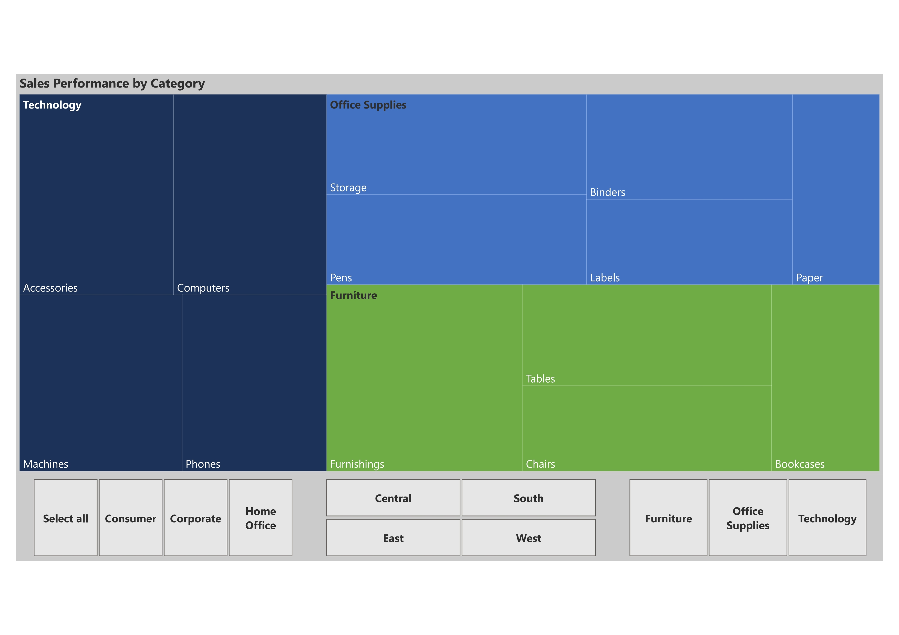
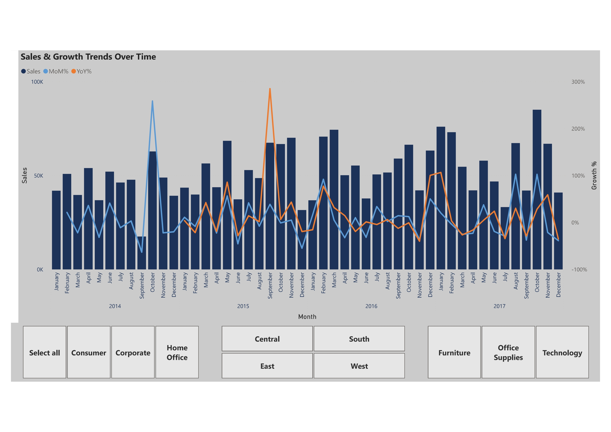
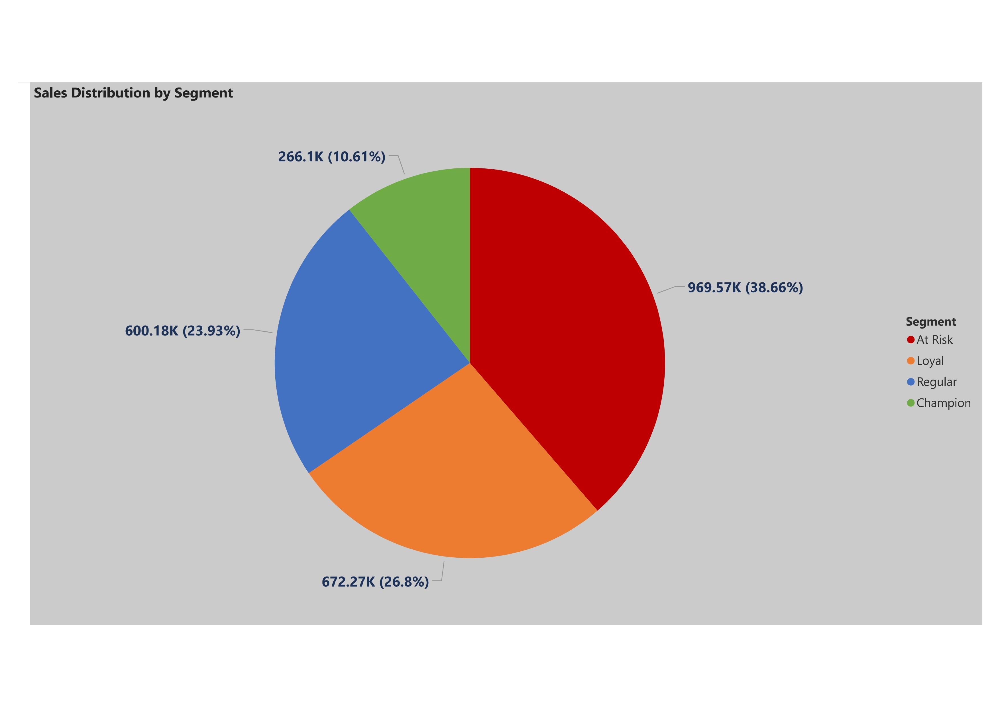

# Superstore Sales Analytics Portfolio Project  

## Introduction  
Retail data reflects more than simple transactions — it captures **customer behavior, regional demand, and profitability dynamics**.  
In this project, I carried out an end-to-end analysis of the **Superstore dataset**, applying SQL, Python, and Power BI to uncover the forces shaping sales performance and to suggest actionable business improvements.  

---

## At a Glance  
- **Dataset:** ~10k+ orders, 2014–2017 (Kaggle Superstore dataset)  
- **Tools:** Python (pandas), SQL (MySQL), Power BI, Excel  
- **Scope:** Data cleaning → SQL DB setup → Advanced analytics (RFM, Cohort, ABC) → BI dashboards  
- **Highlights:**  
  - Revenue grew ~20% between 2014–2017, with Q4 seasonality  
  - Furniture: high sales, but **lowest margins (~5%)** due to discounts  
  - ~40% of customers are “At Risk” per RFM segmentation  
  - Same-Day shipping drives costs up; Standard shipping is most profitable  

---

## Key Findings & Insights  
- **Revenue Trends:** Between 2014 and 2017, revenue rose ~20%, with clear Q4 seasonal peaks.  
- **Category Profitability:** Furniture, while high in sales, showed lowest margins (~5%) due to aggressive discounting.  
- **Geographic Performance:** CA, NY, TX drove >40% of revenue; IL and FL had high sales but weak profitability.  
- **Customer Behavior:** RFM segmentation flagged ~40% of customers as “At Risk,” highlighting retention opportunities.  
- **Logistics Efficiency:** Same-Day shipping increased costs and reduced margins, while Standard shipping was most efficient.  

---

## Business Recommendations  
1. **Discount Optimization:** Reduce Furniture discounts → potential **3–5% margin uplift (~$250K/year)**.  
2. **Customer Retention:** Launch re-engagement campaigns for “At Risk” customers; upsell bundles to “Loyal” and “Champion” customers.  
3. **Regional Strategy:** Double down on top states; refine pricing/margin strategies for underperformers.  
4. **Shipping Policy:** Incentivize Standard shipping to improve logistics efficiency.  

---

## Dashboards  

### Executive Dashboard  
- KPIs: Revenue, Profit, AOV, Customer Count  
- Trends: Revenue & Profit over time  
- Profitability by Region & Category  

### Sales Deep Dive Dashboard  
- Sales by product category & subcategory  
- State-level sales/profitability (map view)  
- Customer segment breakdown (RFM)  

  

---

## Tools & Workflow  
- **Python**: Data cleaning, preprocessing, RFM segmentation.  
- **SQL (MySQL)**: Schema setup, KPI analysis, advanced queries (cohort retention, ABC, YOY comparisons).  
- **Power BI**: Executive dashboards, sales deep-dives, geographic insights.  
- **Excel**: Early exploration, pivot tables, and quick summaries.  

Workflow followed:  
1. Data cleaning & preparation  
2. SQL database setup & profiling  
3. Exploratory + advanced analytics (RFM, cohort, ABC)  
4. Dashboarding for stakeholder insights  

---

## Conclusion  
This project demonstrates how **structured analytics pipelines** — from raw data to BI dashboards — can transform sales transactions into **actionable business strategies**.  

The patterns uncovered in revenue, profitability, and customer behavior show clear paths to:  
- Improve margins  
- Boost retention  
- Optimize operations  

---

# Technical Appendix  

## Repository Structure 

SuperstoreProject/
│
├── README.md
├── Requirements.txt 
│
├── Data/
│ ├── SuperstoreData.csv
│ ├── SuperstoreCleanData.csv
│ └── SuperstoreCleanDataWithSegment.csv
│
├── Python/ 
│ ├── DataCleaning.ipynb
│ └── RFMDataframe.ipynb
│
├── SQL/
│ ├── 1DatabaseSetup.sql
│ ├── 2DataExploration.sql
│ ├── 3BusinessAnalysis.sql
│ └── 4AdvancedAnalytics.sql
│ └── 5PowerBIDataPreparation.sql
│
├── PoerBI/
│ ├── ExecutiveDashboard.pbix
│ ├── SalesPerformanceDeepDive.pbix
│ └── Screenshots/
│ ├── executive_dashboard.png
│ └── sales_deepdive.png
│
└── Excel/
└── Dashboard.xlsx

---

## How to Reproduce  
1. Place raw dataset in `/Data/SuperstoreData.csv`.  
2. Run `Python/DataCleaning.ipynb` → generates `SuperstoreCleanData.csv`.  
3. Execute SQL scripts in order (01 → 05) on MySQL.  
4. Open `.pbix` dashboards in Power BI; connect to cleaned dataset or SQL views.  

---
